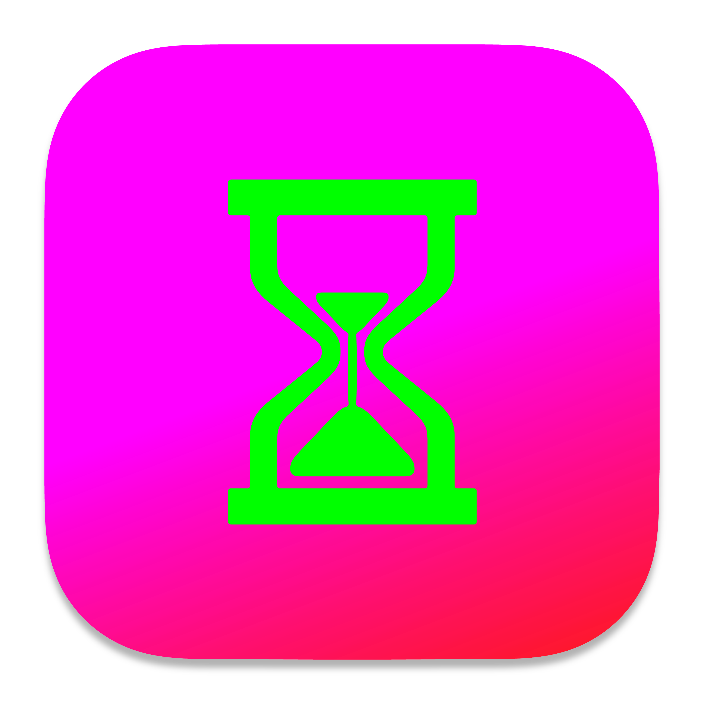
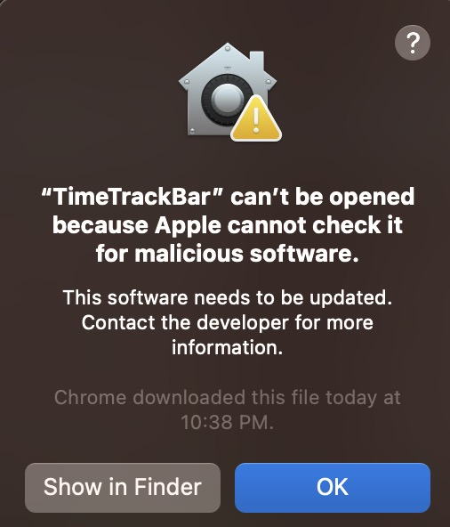

 [☞ English (英文)](https://github.com/aynorway/timetrackbar/blob/master/README.md)&nbsp;&nbsp;&nbsp;&nbsp;&nbsp;&nbsp;&nbsp;&nbsp;[☞ Chinese (中文)](https://github.com/aynorway/timetrackbar/blob/master/README_cn.md)

---

#  [TimeTrackBar Desktop Application](https://github.com/aynorway/ay-timetrackbar-java/tree/master)

Hello everyone, I'm Adrain Y, also known as "老6". This time-tracking software is one of my personal favorite software projects. I've always been on the lookout for a tool that displays both the time and a progress bar, aiming for a more intuitive feel of the passing time. After not finding a minimalist timer that met my requirements for quite some time, I decided to create one myself. Currently, I use this software almost daily to track my work hours, which greatly assists me in understanding and allocating my time more effectively. This project is developed entirely in Java, ensuring easy cross-platform compilation. Versions for both MacBook and Windows have been released. To guarantee the software's compatibility, I've intentionally employed the foundational Unicode character set. In the upcoming versions, I plan to introduce several new features, including report generation, data analysis, and an always-on-top window feature. Moreover, the ability to continue monitoring time even when the computer is in sleep mode is under development. I invite everyone who values their time to give it a try. This software will remain open-source indefinitely, hoping to benefit many.

**Adrian "Old 6"**: Life is precious, don't waste it.

---

## Features

- Extremely user-friendly logic.
- Automatic time calculation with progress display.
- Clear progress bar interface.
- Ability to add/delete multiple timing tasks.
- Start/pause timer functionality.
- Sound alert/mute feature.
- Auto detection of stopwatch/countdown mode.
- "Always On Top" mode for keeping the application window in the foreground.

---

## Installation and Usage

**Windows users**: [☞ Download TimeTrackBarPackage v1.0 for Windows (.exe)](https://github.com/aynorway/timetrackbar/releases/download/v1.0/TimeTrackBarPackage.exe)
 
"After downloading, double-click TimeTrackBarPackage.exe to install. The automatic installation path is: C:\Program Files\TimeTrackBar. Navigate to that path and find TimeTrackBar.exe. Double-click to open. (The Windows interface has not been optimized yet; the main focus currently is on functional effectiveness.)"

**macOS ARM (M-series) users**: [☞ Download TimeTrackBar v1.2 for macOS (.dmg)](https://github.com/aynorway/ay-timetrackbar-java/releases/download/v1.2/TimeTrackBar-1.2.dmg)

How to Resolve the "Cannot Open App" Prompt on MacOS:  

 

If, after downloading, you encounter the following message the first time you try to open `TimeTrackBar.app`: **"Cannot open 'TimeTrackBar.app' because Apple cannot check it for malicious software"**, please do not worry. This is a security feature of macOS. (Because I didn't pay the annual fee for the Apple Developer Program to obtain a signature.)

<br style="clear:both;">

**Solution:**  
Make sure you have dragged the app into the Applications folder. If not, please do so first.
- In the Applications folder, locate `TimeTrackBar.app`. **Do NOT** double-click the app icon directly. Instead, **right-click** (or press and hold the control key while clicking) on `TimeTrackBar.app`.
- From the pop-up menu, select **"Open"**.
- A dialog box will appear warning you that the app might be unsafe. However, this time, there will be an "Open" option. Click on **"Open"**.
This way, the application will start.

Note: **You only need to perform the above steps once**. After that, you can open it like any other application, by simply double-clicking its icon.

**Developers (Java)**: Ensure Java 11 is installed and [download the jar or source code](https://github.com/aynorway/timetrackbar/releases/download/v1.0/TimeTrackBar.jar).

---

## User Interface Guide


From left to right:

- **"+" Button**: Add a new timing task.
- **"-" Button**: Delete a specific timing task.
- **Text Input Box**: Supports up to 7 characters, suitable for brief notes or memos.
- **Progress Bar**: Displays the timing progress.
- **⏲ Icon Button**: Click to expand or hide the time setting panel.
- **Sound Toggle Button**: Default is a musical note (♫). Clicking it changes to a crescent moon (☽) indicating mute. Through this button, you can decide whether to sound an alert when the timer ends.
- **Remaining Time Display**: Shows the remaining time for the timer or countdown.
- **▶ Button**: Start or pause the timer. Blue in stopwatch mode and magenta in countdown mode.
- **⏹ Button**: Stop and reset the timer completely.

---

## User Guide 

1. If you click ▶ without inputting a number (setting a time), it will activate the stopwatch mode.
2. After correctly entering a time and clicking ▶ (or pressing the Enter key), you'll enter countdown mode.
3. You can freely input any time, such as 999 hours 333 minutes. The software will automatically calculate the total duration and convert it to a standard format.
4. Use the ⏹ button to stop, and the timer will automatically reset.

---

## Directory Tree 

```
.
├── ClearableTextField.java
├── FontCheck.java
├── Interface.png
├── META-INF
│   └── MANIFEST.MF
├── MenuHelper.java
├── README.md
├── README_cn.md
├── TimeTrackBar.java
├── UIManagerHelper.java
├── docs
│   ├── macos-app-icon.md
├── icons
│   ├── ttb17.png
│   ├── ttblogo.icns
│   └── ttblogo.iconset
├── pics
│   └── cannotopen.jpeg
└── timbre_whaaat.wav
```

---

Thank you for your support and usage! If you encounter any problems or have any suggestions during use, please feel free to contact me.  
Work Email: adrianyangbiz@gmail.com