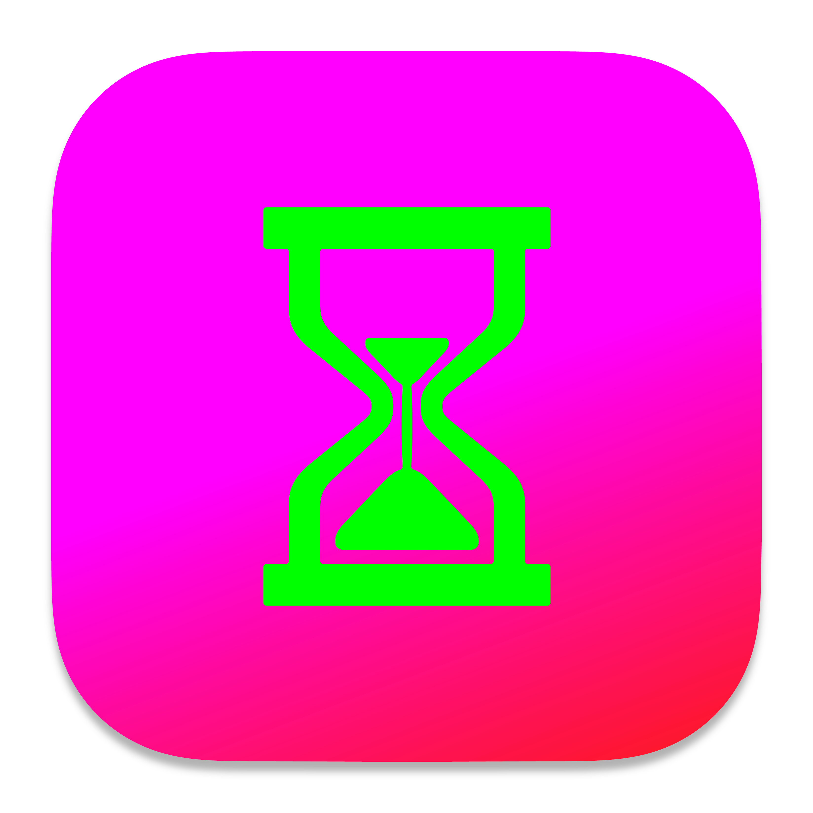
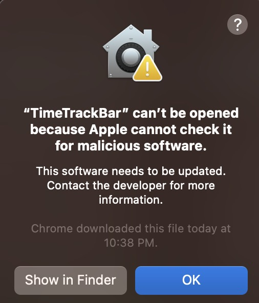
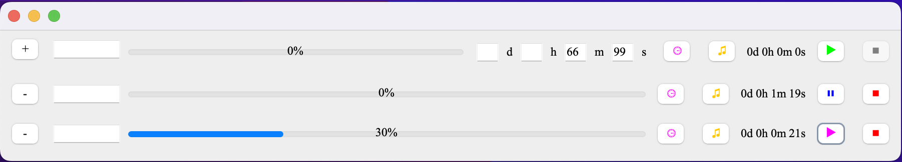

 [☞ English (英文)](https://github.com/aynorway/timetrackbar/blob/master/README.md)&nbsp;&nbsp;&nbsp;&nbsp;&nbsp;&nbsp;&nbsp;&nbsp;[☞ Chinese (中文)](https://github.com/aynorway/timetrackbar/blob/master/README_cn.md)

---

#  [TimeTrackBar PC应用程序 (Mac/Win)](https://github.com/aynorway/ay-timetrackbar-java/tree/master)

大家好，我是Adrain Y，昵称“老6”。这款计时软件是我个人最为喜欢的程序项目之一。我一直寻找一个能够同时显示时间并有进度条的工具，希望能够更直观地感受时间流逝。由于长时间没有找到符合我要求的简约计时软件，我决定自己动手制作。目前，我几乎每天都在使用这款软件来追踪我的工作时间，这非常有助于我更好地了解和分配我的时间。这个项目采用100%Java语言开发，以确保能够方便地为不同平台编译。现已发布了MacBook和Windows两个版本。为了保证软件的兼容性，我特地使用了基础的Unicode字符集。在接下来的版本中，我计划引入多项新功能，如生成报告、数据分析和窗口置顶。另外，让程序在电脑睡眠模式下继续监听时间的功能已经在研发之中。欢迎所有珍惜时间的朋友使用及尝试。该软件将永久开源，希望能帮助到大家。

**Adrian小6**：生命宝贵，不可浪费

---

## 功能特性

- 超级懒人操作逻辑
- 可自动计算时间并显示进度
- 进度条界面，清晰易读
- 可添加/删除多个计时任务
- 开始计时/暂停功能
- 声音提醒/静音功能
- 自动检测秒表/倒计时模式
- 窗口置顶功能

---

## 安装与使用

**Windows 用户**：[☞ 下载 TimeTrackBarPackage v1.0 Windows 版 (.exe)](https://github.com/aynorway/timetrackbar/releases/download/v1.0/TimeTrackBarPackage.exe)

下载后，双击TimeTrackBarPackage.exe安装，自动安装路径为：C:\Program Files\TimeTrackBar
在路径下，找到TimeTrackBar.exe，双击打开即可。（Windows端界面还未优化，目前以功能有效为主）

**macOS ARM（M芯片）用户**：[☞ 下载 TimeTrackBar v1.2 macOS 版 (.dmg)](https://github.com/aynorway/ay-timetrackbar-java/releases/download/v1.2/TimeTrackBar-1.2.dmg)

关于MacOS“无法打开应用”提示的解决方法：  

  

如果下载后，第一次尝试打开TimeTrackBar.app时遇到以下提示：**“无法打开`TimeTrackBar.app`，因为Apple无法检查其是否包含恶意软件”**，请不要担心。这是macOS的一项安全特性。（因为没有给Apple Developer Program交年费以获得签名）

<br style="clear:both;">

**解决方法：**  
确保你已经将应用拖拽到了Applications文件夹中。如果还没有，请先这样做。
- 在Applications文件夹中，找到`TimeTrackBar.app`。**不要**直接双击应用图标。**而是右键点击**（或者按住control键并点击）`TimeTrackBar.app`。
- 在弹出的菜单中选择“**打开**”。
- 会出现一个对话框警告您该应用可能不安全。但这次，您会看到一个“打开”的选项。请点击“**打开**”。
这样，应用就会启动了。

注：**以上步骤只需要这样做一次**，以后就可以像打开其他应用一样，正常直接双击其图标启动即可。

**开发者 (Java)**：确保已安装 Java 11 并[下载源代码或 TimeTrackBar.jar 文件](https://github.com/aynorway/timetrackbar/releases/download/v1.0/TimeTrackBar.jar)。

---

## 界面说明

从左到右顺序：

- **"+" 按钮**：新增计时任务。
- **"-" 按钮**：删除指定计时任务。
- **文本输入框**：最多支持7个字，适用于临时备注或备忘。
- **进度条**：显示计时进度。
- **⏲图标按钮**：点击以展开或隐藏时间设置面板。
- **声音切换按钮**：默认为音符 (♫)。点击后变为月亮 (☽) 表示已静音。通过此按钮，你可以决定计时结束时是否发出声音提醒。
- **剩余时间显示**：展示计时或倒计时的剩余时间。
- **▶ 按钮**：启动或暂停计时。秒表模式下为蓝色，倒计时模式下为品红色。
- **⏹ 按钮**：完全停止并重置计时。

---

## 使用指南 

1. 无输入数字（设置时间），直接点击▶，则启动秒表模式。
2. 正确输入数字（设置时间）后，点击▶（或按回车键），进入倒计时模式。
3. 你可以随心所欲地输入时间，如999小时333分钟，软件会自动计算总时长并转化为标准格式。
4. 使用⏹按钮来停止，计时器自动重制。

---

## Tree 

```
.
├── ClearableTextField.java
├── FontCheck.java
├── Interface.png
├── META-INF
│   └── MANIFEST.MF
├── MenuHelper.java
├── README.md
├── README_cn.md
├── TimeTrackBar.java
├── UIManagerHelper.java
├── docs
│   ├── macos-app-icon.md
├── icons
│   ├── ttb17.png
│   ├── ttblogo.icns
│   └── ttblogo.iconset
├── pics
│   └── cannotopen.jpeg
└── timbre_whaaat.wav
```

---

感谢您的支持与使用！如果在使用过程中遇到任何问题或有任何建议，欢迎联系我。  
工作邮箱：adrianyangbiz@gmail.com
